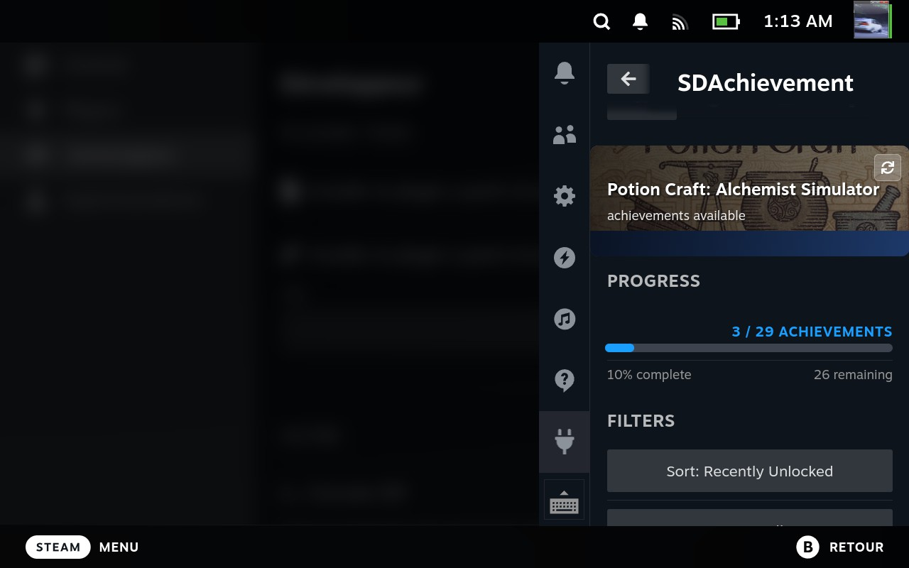
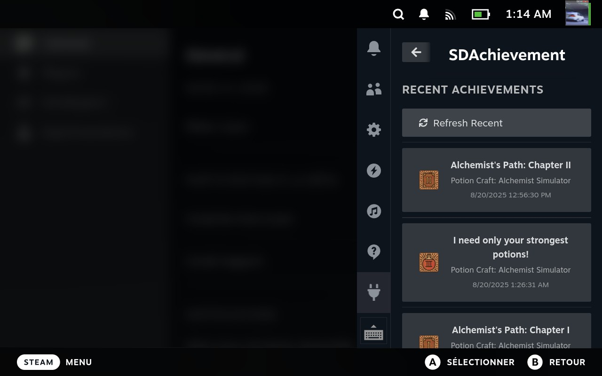
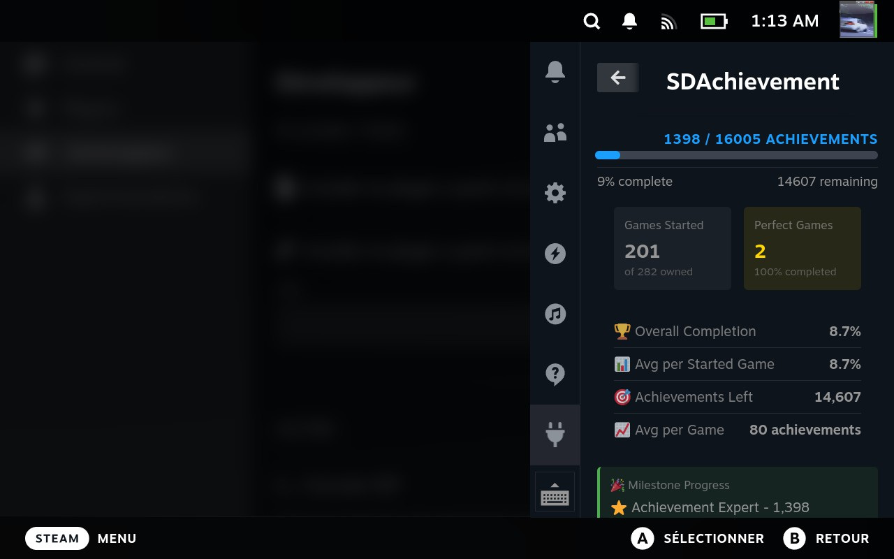

# 🏆 SDAchievement – Steam Achievement Tracker for Steam Deck

A Decky Loader plugin that tracks your Steam game progress and achievements directly inside the Steam Deck's Quick Access menu.

---

## ✨ Features

- 📊 **Real-time Progress Tracking** – Monitor current game progress and stats  
- 🏆 **Achievement Management** – View detailed achievement lists with unlock status  
- 📈 **Overall Progress** – Track your Steam profile’s global achievement statistics  
- ⭐ **Recent Achievements** – See recently unlocked achievements across all games  
- 🔄 **Auto-refresh** – Configurable automatic updates (30–120 seconds)  
- 🎯 **Game Detection** – Automatic detection of currently running games  
- 📱 **Seamless UI** – Native integration with Steam Deck Quick Access menu  
- ⚙️ **Settings Management** – Easy Steam API integration and configuration  

---

## 📦 Installation

### Prerequisites
1. Install **Decky Loader** on your Steam Deck  
   👉 [Installation guide](https://github.com/SteamDeckHomebrew/decky-loader)  
2. (Optional) Get a **Steam API Key**  
   👉 [Get yours here](https://steamcommunity.com/dev/apikey)  

---

## 🚀 Usage

1. Install the plugin with Decky Loader  
2. Open the **Settings tab** and configure your Steam API key  
   - User ID is auto-detected  
3. Launch any game  
4. Open **Quick Access** (… button)  
5. Select the **🏆 Trophy icon** (SDAchievement)  

---

## 🖼️ Screenshots

### 🎮 Current Game Tab
See the currently running game, unlocked achievements, and progress.

### 📅 Recent Achievements
View your most recently unlocked achievements across all games.

### 📊 Overall Progress
Track your global statistics and perfect games.

---

## 🔧 Configuration

### Steam API Setup
1. Obtain your key from [Steam Web API](https://steamcommunity.com/dev/apikey)  
2. Enter it in the **Settings tab**  
3. Your Steam User ID will be detected automatically  

### Auto-refresh
- Toggle auto-refresh on/off  
- Set update interval (15–300 seconds)  
- Only active while viewing the **Current Game** tab  

---

## 🐛 Troubleshooting

### Plugin Not Loading
- Verify Decky Loader is installed  
- Check plugin directory: `~/homebrew/plugins/SDAchievement/`  
- Restart your Steam Deck or reload plugins  

### No Achievement Data
- Make sure the Steam API key is configured  
- Verify the game supports achievements  
- Launch the game at least once  
- Try the manual refresh button  

### Performance Issues
- Check cache directory permissions  
- Lower auto-refresh frequency  
- Clear cache files if corrupted  

---

## 🤝 Contributing

Contributions are welcome!  

1. Fork the repository  
2. Create a feature branch  
3. Follow existing code style  
4. Add tests for new features  
5. Submit a pull request  

---

## 📄 License

Released under the **BSD-3-Clause License** – see [LICENSE](LICENSE) for details.  

---

## 🙏 Acknowledgments

- [Decky Loader](https://github.com/SteamDeckHomebrew/decky-loader) community  
- Steam Deck homebrew developers  
- Steam Web API documentation  

---

## 📞 Support

- 🐞 [Report issues / request features](https://github.com/Wariie/SDAchivement/issues)  
- 💬 [Join the Decky Loader Community Discord](https://discord.gg/deckyloader)  

---

**Made with ❤️ for the Steam Deck community**  
*Happy achievement hunting!* 🎮🏆
